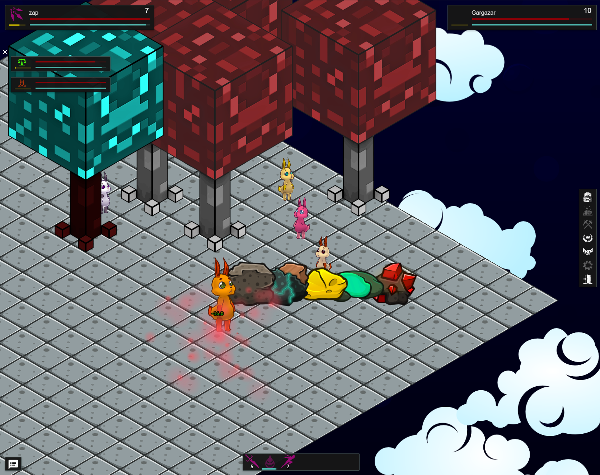
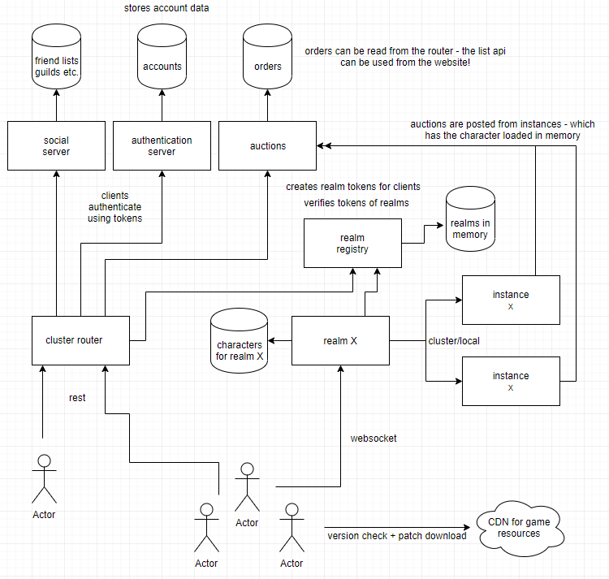

# core-ext-game [](https://travis-ci.org/codingchili/chili-game-ext)

A microservices based distributed 2d MMORPG with Hazelcast and Vert.x on Java 11, currently 20k LOC + configuration.


Sample in-game image of a simple test world.

Uses Pixi.js for rendering and assets from gamedeveloperstudio, see [license](https://www.gamedeveloperstudio.com/license.php). This repository doesn't contain any client code or assets - as these may not be included in any open source listing. Contributions are welcome for the backend but only the core team may work on the client/assets. 

## Building

- Requires Polymer-cli.
- Requires Bower.

Builds the project and runs all tests.
```console
./gradlew build
```

Create the distribution zip and run polymer build with:
```console
./gradlew archivePrototype
```

To run the project without having to build a zip and perform polymer builds:
```console
./gradlew prototype -Pexec=--generate
./gradlew prototype -Pexec=--deploy
```

Building a docker image, make sure to build the distribution zip first.
```console
docker build -f Dockerfile ./build
docker run -p 443:443 -p 1443:1443 -p 9301:9301 -it <imageId>
```

## Background
This is a 2D MMORPG that is in development, we are currently working on getting the core mechanics in place 
before we consider any gameplay/story. We're also trying to keep the development workflow as fast as possible in order to scale. Some examples include map designer, dialog designer, npc designer, reloadable scripts and fast startup times - 5s to start the current prototype with gradle and 2s to start it fully from a distribution on Java 11.

Focusing on
- ease of development: simple event passing and handler-based server development.
- fast feedback loop: fast startup times, fast client load times, unit-testable.
- simple and extendable: scripted events, yaml-based npc/item/spell/affliction configurations. 

Overview of mechanics completed and TBD

Core mechanics
- [X] movement
- [X] player chat
- [X] spell engine (cooldown, learned spells, charges)
- [X] dialog engine
- [X] affliction engine
- [ ] cross realm/instance chat
- [ ] friend lists
- [X] instance travel
- [X] instance loading
- [ ] crafting
- [ ] questing
- [ ] dynamically deployed instances

Npcs/Entities
- [X] scripted npcs/entities
- [X] support for animations
- [X] spawn entities/npcs from script
- [X] NPC initiated dialogs
- [X] NPC/interaction dialogs

User interface
- [X] spellbar
- [X] character status
- [X] chat box
- [ ] creature targeting
- [ ] inventory
- [ ] quest tracker
- [ ] crafting
- [ ] in-game help

Effects
- [X] skybox
- [ ] sound effects
- [ ] spell effects

Website
- [X] patch notes
- [X] realm list
- [X] character creation
- [X] login
- [ ] highscores
- [ ] character viewer
- [ ] auction client

##### Audience :fire:
* Game developers seeking to implement a 2D RPG multiplayer game.
* Aspiring game developers with an interest in backend development.
* Players who are into simplistic 2D MMORPG's.

##### Great software :blue_heart:
To make this project a reality we use only great software.

On the backend
- [CQEngine](https://github.com/npgall/cqengine) primary persistence store.
- [Hazelcast](https://hazelcast.com/) for cluster discovery.
- [Vert.x](https://vertx.io/) for threading and transports.
- [chili-core](https://github.com/codingchili/chili-core) for maximum ease of development.

On the frontend
- [Polymer](https://www.polymer-project.org/) for the website and game UI.
- [PIXI.js](http://www.pixijs.com/) for client side rendering.

For art
- [MagicaVoxel](https://ephtracy.github.io/) for artwork!
- [Spine 2d](http://esotericsoftware.com/) for animations!


##### Contributing :purple_heart:
Do you have an idea for a spell? a new player class? an NPC? gameplay mechanics? story? anything really, we are open 24/7 for contributions. Just submit an issue or a PR.

---

## Architecture



Some services comes with additional resources, these can be bundled within the jar if moved to **src/main/resources**. This also applies to configuration files, it is however recommended that these are easily edited. 

###### Services
* Authentication: Account creation and available realms.
* Routing: Routes client requests in/out of the cluster.
* Realms: Handles incoming connections, instance travel.
 * Instances: Handles game logic.
* Realm registry: keeps track of active realms. 
* Website: Provides an interface for account/character/realmlist.
* Logging: Receives logging data from the other components.
* Social: Achievements, chat, guilds. (TBD)
* Auction house: Handles asynchronous trading with orders/offers. (TBD)
* Serverstatus: Provides a quick overview of system uptime. (TBD)

Patching is no longer a service - the webseed standard was not very well supported so support was dropped. We are aiming to create a browser based game primarily and will rely on a CDN to provide game resources. We want to avoid serving files over the cluster or machines that handles the website or the game state.

Communication between services is done over the cluster/local bus, other available transports such as websock, tcp, udp and rest is available but not recommended unless a service is not able to join the cluster. Services that needs to authenticate another service should use the AuthenticationGenerator to generate pre-shared keys, secrets and generate tokens. This may be invoked from the standard launcher in chili-core, using the `--generate` commandline argument.

All communication between services in different JVM's uses a text-protocol based on JSON for simplicity.
